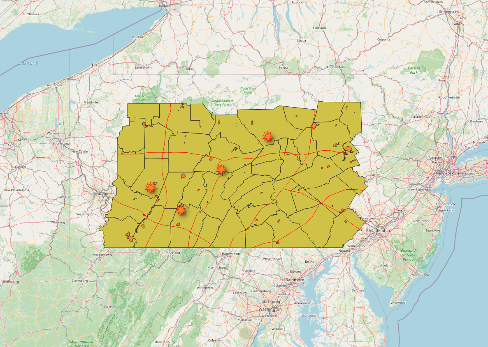
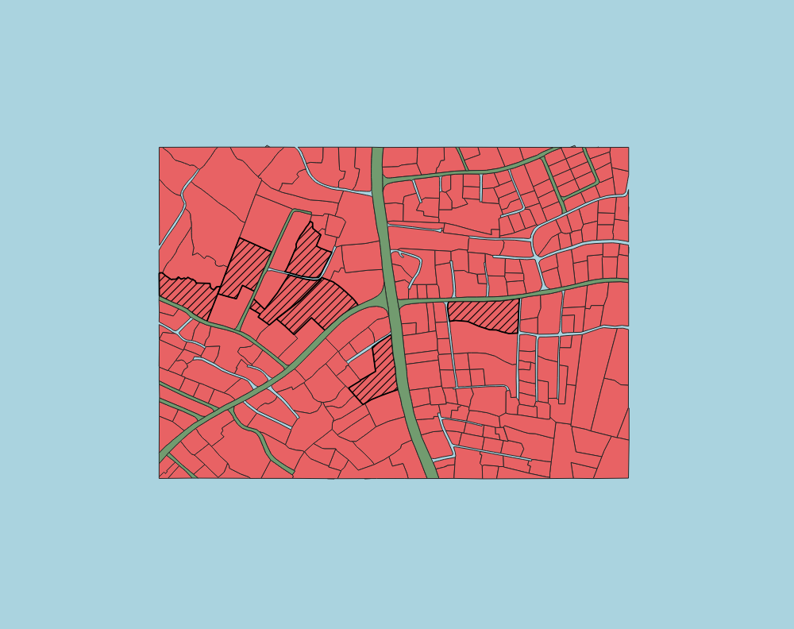
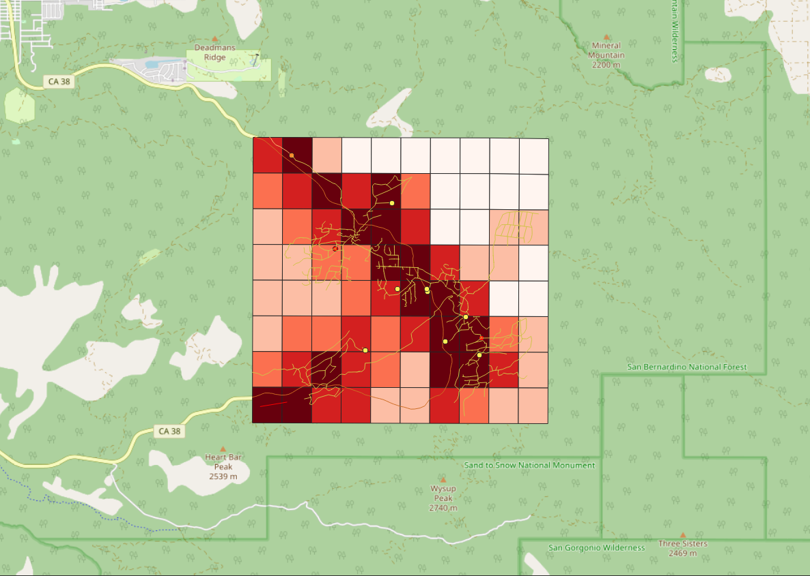
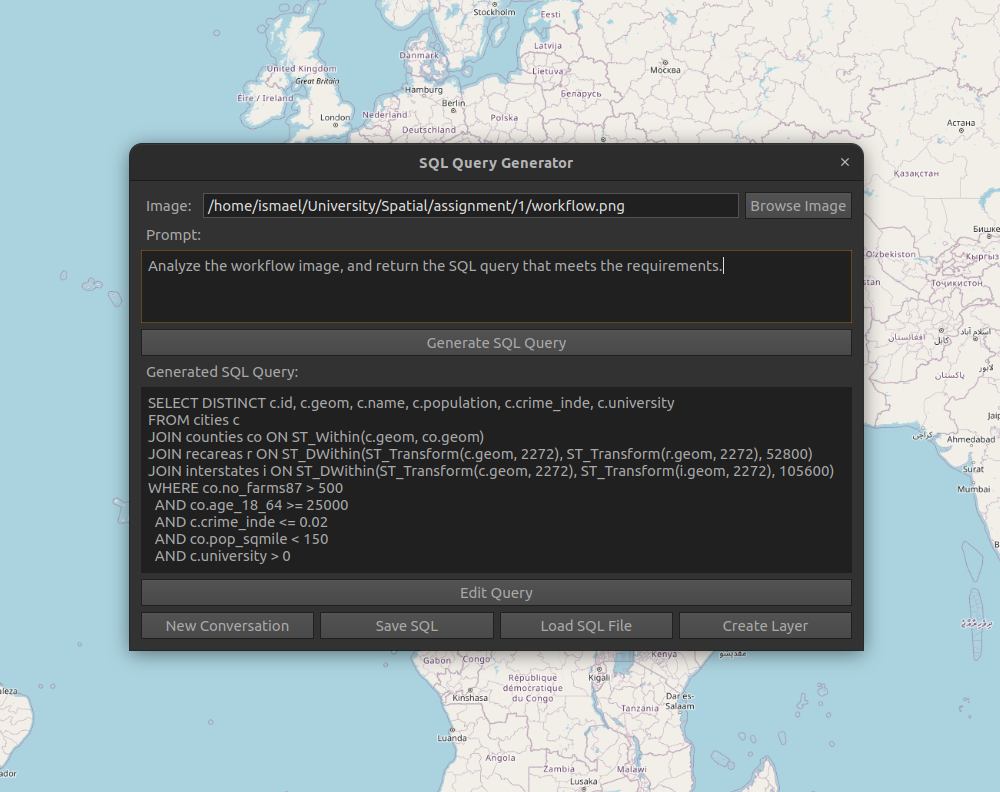
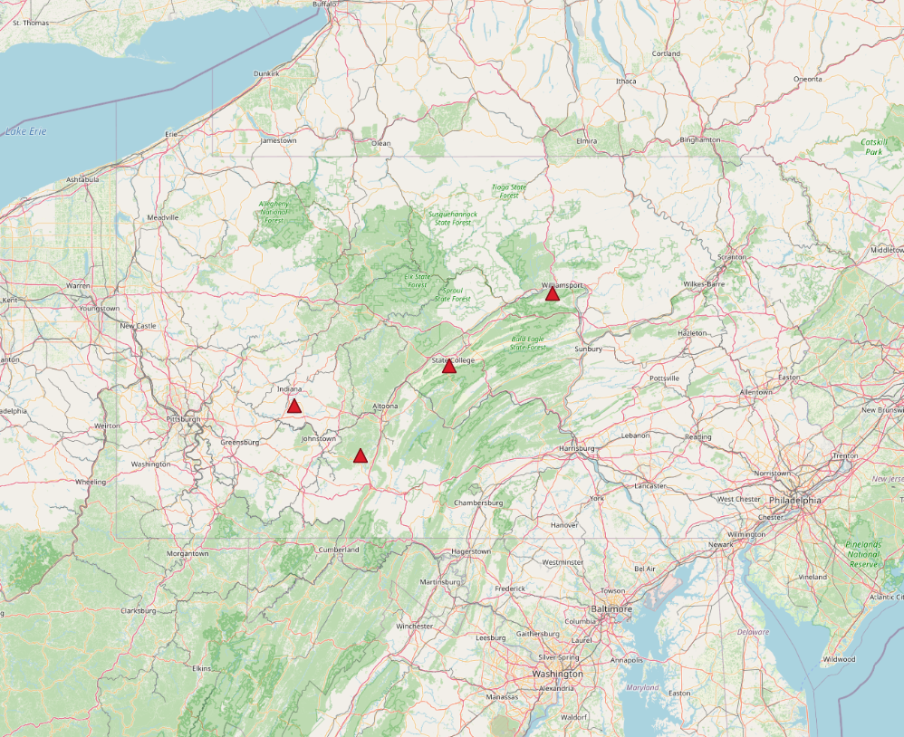

# Spatial Data Analysis
- Jen and Barry's Site Selection
- School Site Selection 
- Tree Cutting Priority Analysis 
- LLM Query Generator

## **Introduction** 

This report presents four spatial analysis projects demonstrating GIS technologies in real-world decision-making. Each
project employs different tools: PostGIS for database management and spatial queries, GeoPandas for Python-based
analysis, and QGIS for visualization. A plugin development project showcases AI integration with traditional GIS
workflows.

The first project uses PostGIS to automate site selection for an ice cream business based on demographic and geographic
criteria. The second identifies suitable parcels for school construction through land-use analysis. The third
prioritizes tree removal in Fire Creek based on mortality data and risk factors. The fourth introduces a QGIS plugin
that uses large language models to generate SQL queries from visual workflow diagrams.

## **Analysis Questions**

#### **Ice-Cream Shop Site Selection**

This analysis identifies optimal Pennsylvania cities for new ice cream shop locations by evaluating candidates against
seven criteria spanning demographics, infrastructure, and quality of life. The process narrows all available cities to
nine preliminary candidates through attribute-based filtering, then applies spatial analysis to select four final
locations based on infrastructure proximity.

####  

#### **School Site Selection**

This analysis determines which parcels are suitable for new schools by simultaneously evaluating land-use designations,
parcel size, building absence, and road network access. The goal is to identify viable options that meet safety
standards, accessibility needs, and development regulations while avoiding infrastructure conflicts.

####  

#### **Tree-Cutting Priority**

This analysis prioritizes tree removal resources in Fire Creek by identifying high-risk areas where tree mortality
intersects with human activity, critical infrastructure, and emergency routes. The multi-criteria assessment produces
priority zones that guide crews toward areas with the greatest impact on public safety.

####  

#### **LLM Query Generator Plugin**

This project explores whether AI can translate visual analysis workflows into executable SQL queries. The plugin accepts
flowcharts or diagrams and automatically generates PostGIS code, testing whether large language models can interpret
spatial reasoning and produce functional queries for QGIS map layers.

## **Criteria**

#### **Ice-Cream Site Selection**

* Greater than or equal to 500 farms for milk production

* Labor pool of at least 25,000 individuals between ages 18 and 64

* Crime index less than or equal to 0.02

* Population density below 150 persons per square mile

* Located near a university or college

* At least one recreation area within 10 miles

* Interstate highway within 20 miles

* Final target narrows to 4 optimal city locations

####  

#### **School Site Selection**

* Land-use type must be unused, agricultural lands, or commercial lands

* Parcel area equal to or greater than 5,000 square meters

* No buildings present on the land-use parcels

* Location within 25 meters distance from the nearest road

####  

#### **Tree-Cutting Priority**

* Tree mortality levels

* Proximity to community features

* Distance from egress routes

* Population density in surrounding areas

* Distance to electric utilities

* Combined weighted priority score assigned to each grid cell


## **Data**

#### **Ice-Cream Site Selection**

|   Dataset   |    Description     | Data Model |   Type   |                                       Attributes                                       |
|:-----------:|:------------------:|:----------:|:--------:|:--------------------------------------------------------------------------------------:|
|   cities    |  Point locations   |   Vector   | Discrete |      Geom, Name, Population, total\_crim numeric, crime\_inde numeric, university      |
|  counties   | Polygon boundaries |   Vector   | Discrete | Geom, area, perimeter, name, pop1990, age\_18\_64, no\_farms87, pop\_sqmile, sq\_miles |
| interstates |   Line networks    |   Vector   | Discrete |                                       Geom, name                                       |
|  recareas   | Polygon boundaries |   Vector   | Discrete |                                 Geom, area, perimeter                                  |

#### **School Site Selection**

|  Dataset  |    Description     | Data Model |   Type   |             Attributes              |
|:---------:|:------------------:|:----------:|:--------:|:-----------------------------------:|
| buildings | Polygon structures |   Vector   | Discrete |       Geom, area, owner, type       |
|  landuse  |  Polygon parcels   |   Vector   | Discrete |    Geom, owner, type, sale, area    |
|   roads   |  Polygon networks  |   Vector   | Discrete | Geom, type, no\_paths, name, length |
|  sewage   |  Point locations   |   Vector   | Discrete |        Geom, type, polluted         |
|  cistern  |  Point locations   |   Vector   | Discrete |        Geom, type, polluted         |

####  

#### **Tree-Cutting Priority**

|      Dataset       |   Description   | Data Model |    Type    |                                 Attributes                                 |
|:------------------:|:---------------:|:----------:|:----------:|:--------------------------------------------------------------------------:|
|   Tree mortality   |   Grid cells    |   Raster   | Continuous |                Geom, shape\_leng, shape\_area, tot\_mortal                 |
| community features | Point locations |   Vector   |  Discrete  |                             Geom, name, weight                             |
|   egress routes    |  Line networks  |   Vector   |  Discrete  |                         Geom, weight, shape\_leng                          |
|  populated areas   |   Grid cells    |   Raster   | Continuous | Geom, place\_name, pop, pop\_per\_sq, area\_sqmi, shape\_leng, shape\_area |
| electric utilities |  Line networks  |   Vector   |  Discrete  |                            Geom, voltage, type                             |

####  

#### **LLM Query Generator**

|      Dataset      |    Description    |  Data Model   |    Type     |             Attributes             |
|:-----------------:|:-----------------:|:-------------:|:-----------:|:----------------------------------:|
|   Input images    | Workflow diagrams |     Image     | Non-spatial |  Format, resolution, content type  |
| Generated queries |     SQL text      |     Text      | Non-spatial |  Query string, syntax validation   |
|   Output layers   | Variable geometry | Vector/Raster |  Variable   | Depends on query execution results |

  

## **Methodology**

#### **Ice-Cream Shop Site Selection (PostGIS \+ QGIS)**

The analysis imported all shapefiles into a PostGIS database with NAD27 coordinates (SRID 4267), which required
transformation for distance calculations.

**First**, a view identified suitable counties by filtering for farm counts exceeding 500, populations aged 18-64 of at
least 25,000, and population density below 150 persons per square mile. This significantly reduced the search area.

**Second**, a view selected cities within suitable counties that met crime index thresholds and had university presence,
narrowing candidates to nine cities meeting all county and city-level criteria.

**Third**, evaluate interstate proximity through spatial distance calculations. Both cities and interstates layers were
reprojected into Pennsylvania State Plane North (feet units). The ST\_DWithin function identified cities within 20
miles (105,600 feet) of any interstate highway.

**Finally**, using the same coordinate system, another ST\_DWithin query identified cities within 10 miles (52,800 feet)
of recreation areas, producing four cities satisfying all seven criteria.

**Code**: `SQL`

```SQL
SELECT DISTINCT c.id, c.geom, c.name, c.population, c.crime_inde, c.university 

FROM cities c
JOIN counties co ON ST_Within(c.geom, co.geom) 
JOIN recareas r ON ST_DWithin(ST_Transform(c.geom, 2272), ST_Transform(r.geom, 2272), 52800)
JOIN interstates i ON ST_DWithin(ST_Transform(c.geom, 2272), ST_Transform(i.geom, 2272), 105600)

WHERE co.no_farms87 > 500 
  AND co.age_18_64 >= 25000 
  AND c.crime_inde <= 0.02 
  AND co.pop_sqmile < 150 
  AND c.university > 0
```

####

#### **School Site Selection (PostGIS \+ QGIS)**

**First**, querying the landuse layer for parcels classified as unused, agricultural, or commercial, establishing the
fundamental land-use requirement subset.

**Second**, the ST\_Area function calculated parcel sizes, excluding any below 5,000 square meters to ensure adequate
space for school facilities, playgrounds, and parking.

**Third**, the ST\_Intersects function identified parcels overlapping with existing buildings. A NOT EXISTS subquery
eliminated these parcels, ensuring only vacant land remained for development without demolition needs.

**Finally**, the ST\_DWithin function identified parcels within 25 meters of roads, ensuring reasonable access for
buses, parents, and emergency vehicles.

The complete query combined all four criteria using nested WHERE clauses and spatial functions. Results were exported to
QGIS for visualization, with qualifying parcels symbolized distinctly alongside roads and buildings for spatial context.
This allowed planners to assess both which parcels met criteria and their geographic distribution relative to existing
infrastructure.

**Code**: `SQL`

```SQL
SELECT l.id, l.type, l.area, l.owner, l.geom, ST_Centroid(l.geom)

AS centroid, MIN(ST_Distance(ST_Centroid(l.geom), r.geom)) AS min_road_dist

FROM "Landuse" l JOIN "Roads" r ON ST_DWithin(l.geom, r.geom, 25)

WHERE LOWER(l.type) IN ('un-used', 'agricultural areas', 'commercial lands') AND COALESCE(l.area, ST_Area(l.geom)) >= 5000 AND NOT EXISTS (SELECT 1 FROM "Buildings" b WHERE ST_Intersects(b.geom, l.geom))

GROUP BY l.id, l.type, l.area, l.owner, l.geom;
```

####

#### **Tree-Cutting Priority (GeoPandas \+ QGIS)**

Five risk factors were calculated and normalized (0 to 1).

**First**, tree mortality risk was assessed by converting the mortality raster to polygons with values normalized by the
dataset maximum.

**Second**, community features risk involved calculating minimum distances from grid centroids, which were then inverted
and normalized with feature weights adjusting the scores.

**Third**, egress route risk used distances to evacuation routes transformed into risk scores, with route weights
refining the scoring.

**Fourth**, population density statistics were extracted and normalized, with higher densities increasing priorities.

**Finally**, electric utility proximity converted distances to utility lines into risk scores, with higher voltage lines
receiving greater weight.

**Code**: `Python`

```python
crs     = "EPSG:3857"
layers  = [trees, community, roads, population, transmission, substations, grid, town_boundary]
layers  = [l.to_crs(crs) for l in layers]
trees, community, roads, population, transmission, substations, grid, town_boundary = layers

trees_r = to_raster(gdf=trees)
comm_r  = to_raster(gdf=community)
roads_r = to_raster(gdf=roads)
pop_r   = to_raster(gdf=population)

def euclidean(binary_mask): return distance_transform_edt(binary_mask == 0) * resolution

dist_trees = euclidean(binary_mask=trees_r)
dist_comm  = euclidean(binary_mask=comm_r)
dist_roads = euclidean(binary_mask=roads_r)
dist_pop   = euclidean(binary_mask=pop_r)
dist_util  = euclidean(binary_mask=util_r)

zs = zonal_stats(grid, priority_raster, transform, stats=["mean"], 0)

grid["priority"] = [z["mean"] for z in zs]
```

####

#### **LLM Query Generator Plugin Development**

**First**, the plugin development established the basic architecture with Python files for QGIS integration, including
the main plugin class, user interface, and metadata configuration. The plugin was registered in QGIS's plugins menu and
toolbar.

**Second**, the user interface includes an image upload component for workflow diagrams, a text display area for
generated SQL queries, and action buttons for query generation, execution, and layer creation using Qt widgets.

**Third**, the core functionality integrates the Gemini-Flash model API to process uploaded images. When users select an
image file, the plugin converts it and sends it to the LLM with a prompt to interpret the visual workflow, identify
spatial operations, and translate these into PostGIS SQL queries.

**Fourth**, the LLM response is parsed to extract SQL query text, which is displayed for user review. Input validation
ensures queries contain expected SQL keywords and PostGIS functions. Users can modify queries before execution.

**Fifth**, query execution uses QGIS's database connection system. The plugin establishes a PostGIS connection, executes
the query, and captures results. Error handling manages syntax errors or database issues with informative feedback.

**Sixth**, upon success, the plugin creates a new vector layer in QGIS with default styling.

**Code**: `Python`

```python
class SQLQueryGeneratorDialog(QDialog):
    def __init__(self, parent=None):
        super().__init__(parent)
        self.setWindowTitle("SQL Query Generator")
        self.setMinimumWidth(600)
        self.setMinimumHeight(400)
        self.setup_ui()
```
```python
class SQLQueryGeneratorPlugin:
    def __init__(self, iface):
        self.iface = iface
        self.dialog = None
```
```python
def classFactory(iface):
    return SQLQueryGeneratorPlugin(iface)
```

## **Results**

#### **Ice-Cream Shop Site Selection**


####  

#### **School Site Selection**


####  

#### **Tree-Cutting Priority**


####  

#### **LLM Query Generator**



####



## **Conclusion**

These four projects show how different GIS technologies can solve real spatial analysis problems. The ice-cream shop
analysis used PostGIS to evaluate locations against multiple criteria, turning what would be tedious manual work into an
automated process. The school site selection brought together land-use rules, size requirements, and distance
calculations to find parcels that met all conditions at once. For the tree-cutting priority project, I combined several
risk factors using weighted scoring to help allocate limited resources where they're needed most. The LLM plugin was an
experiment in making spatial analysis easier by letting users draw their workflow and have it converted to SQL using the
Gemini-Flash API.

Working with PostgreSQL, PostGIS, Python, and QGIS throughout these projects proved to be a solid combination. PostGIS
handled the database and spatial queries, Python dealt with the more complex calculations, and QGIS made it possible to
create clear visualizations. Each project had its own challenges, but they all followed a similar pattern of breaking
down the problem, applying the right spatial operations, and presenting the results in a way that supports actual
decisions. The tools are open-source and accessible, which means these methods can be applied to similar problems in
business planning, urban development, or environmental management without expensive proprietary software.
